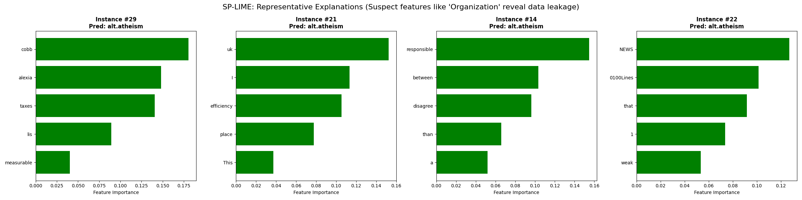

# LIME: Explaining the Predictions of Any Classifier (Reproduction)

This repository contains a Python reproduction of the seminal paper **"Why Should I Trust You?: Explaining the Predictions of Any Classifier"** (Ribeiro et al., KDD 2016).

The goal of this project is to implement **LIME** (Local Interpretable Model-agnostic Explanations) and **SP-LIME** (Submodular Pick) from scratch to demonstrate that high accuracy on validation sets does not imply a trustworthy model.

---

## 🧪 Key Results

### 1. The "Husky vs. Wolf" Experiment (Image)

We reproduced the experiment described in **Section 6.4**. We trained a classifier on a biased dataset where **Wolves appear on Snow** and **Huskies on Grass**.

- **Prediction:** The model predicts "Wolf" for a Husky sitting on snow.
- **LIME Explanation:** As shown below, the explanation highlights only the background (snow/artifacts), proving the model ignores the animal entirely. It is a **"Snow Detector,"** not a Wolf detector, most importantly the model doesn't base its prediction on the caracteristics of the animal, but rather on some random artifacts.  


### 2. The "Un-Trustworthy" Classifier (Text & SP-LIME)

We reproduced **Section 6.2** using the **20 Newsgroups** dataset. We trained an SVM that achieves 95% accuracy but relies on spurious artifacts (email headers).

- **Random Selection:** Often shows valid predictions, misleading the user into trusting the model.
- **SP-LIME Selection:** Mathematically selects a representative set. It successfully surfaces instances where the model relies on `Organization`, `Posting-Host`, and `Nntp-Posting`, identifying data leakage immediately.



---

## 📂 Project Structure
```
lime_reproduction/
│
├── README.md               # This file
├── requirements.txt        # Dependencies
├── .gitignore             
│
├── data/                   # Raw images and text datasets (not in git)
│   ├── raw/
│   │   ├── husky_vs_wolf/
│   │   │   ├── train/
│   │   │   │   ├── wolf_snow/      # 5 images of wolves on snow
│   │   │   │   └── husky_grass/    # 5 images of huskies on grass
│   │   │   └── val/
│   │   │       └── husky_snow/     # 1 image of husky on snow (trick image)
│   
│
│
├── src/                    # Core Library
│   ├── __init__.py
│   │
│   ├── core/               # Mathematical Engine
│   │   ├── __init__.py
│   │   ├── base.py         # Abstract LIME Base Class
│   │   ├── k_lasso.py      # K-LASSO Solver (Algorithm 1)
│   │   └── sp_lime.py      # Submodular Pick (Algorithm 2)
│   │
│   ├── explainers/         # Domain Implementations
│   │   ├── __init__.py
│   │   ├── lime_text.py    # Text Perturbation & Vectorization
│   │   └── lime_image.py   # Image Segmentation & Masking
│   │
│   └── utils/              # Helpers
│       ├── __init__.py
│       ├── segmentation.py # Quickshift/SLIC wrappers
│       ├── visualization.py# Plotting explanations
│
├── experiments/            # Reproducing Paper Results
│   ├── 01_text_reproduction.ipynb      
│   ├── 02_husky_vs_wolf.ipynb     
│   └── 04_sp_lime_global.ipynb      
│
├── results/                # Generated plots and figures
│   ├── husky_wolf_explanation.png
|   |── lime.png
│   └── sp_lime_text_results.png
│
└── tests/                  # Unit Tests
    ├── test_k_lasso.py
    ├── test_text.py
    └── test_image.py
```

---

## 🚀 Installation

### 1. Clone the repository
```bash
git clone https://github.com/OUM124/lime-reproduction.git
cd lime-reproduction
```

### 2. Install dependencies
```bash
pip install -r requirements.txt
```

**Key libraries:** `numpy`, `scikit-learn`, `scikit-image`, `matplotlib`, `Pillow`, `scipy`, `jupyter`

---

## 💻 Usage & Reproduction

### Experiment 1: Husky vs. Wolf (Image Bias)

This demonstrates **Local Interpretability** on a broken image classifier.

1. **Prepare data:** Ensure you have training images in `data/raw/husky_vs_wolf/`:
   - `train/wolf_snow/` - 5 images of Wolves on Snow
   - `train/husky_grass/` - 5 images of Huskies on Grass
   - `val/husky_snow/` - 1 image of Husky on Snow (trick image)

2. **Run the notebook:**
```bash
   jupyter notebook experiments/03_bad_classifier.ipynb
```

3. **Output:** A visualization showing the superpixels responsible for the prediction (snow, not the dog!).

---

### Experiment 2: Detecting Data Leakage (SP-LIME on Text)

This demonstrates **Global Interpretability** using the Submodular Pick algorithm.

1. **Run the experiment:**
```bash
   python experiments/04_sp_lime_global.ipynb
```

2. **Output:** The top instances selected by SP-LIME will display features like `Organization`, `Posting-Host`, or `Nntp-Posting-Host`, revealing the model is cheating by relying on email metadata.

---

## 🧠 Implementation Details

### LIME (Local Interpretable Model-agnostic Explanations)

We implemented the core LIME logic in `src/core/base.py`.

- **Perturbation:** Generate neighborhood data by randomly masking superpixels (images) or removing words (text).
- **Distance Kernel:** Weight samples using an exponential kernel: 
```
  π_x(z) = exp(-D(x, z)² / σ²)
```
- **K-LASSO:** Implemented Algorithm 1 from the paper to select K features and fit a weighted linear model.

**Key equation:**
```
ξ(x) = argmin_{g∈G} L(f, g, π_x) + Ω(g)
```

### SP-LIME (Submodular Pick)

We implemented Algorithm 2 in `src/core/sp_lime.py`.

1. Constructs an **Explanation Matrix W** (n × d')
2. Computes **Global Feature Importance I**
3. Uses a **greedy algorithm** to maximize the coverage function:
```
   c(V, W, I) = Σ 1[∃i∈V: W_ij > 0] · I_j
```

This ensures the selected instances explain diverse model behaviors (non-redundant coverage).

---

## 📊 Results

### Quantitative Results

| Experiment | Metric | Value | Interpretation |
|------------|--------|-------|----------------|
| Husky vs Wolf | Accuracy | 90% | High accuracy, but... |
| Husky vs Wolf | Snow Detection | 100% | ...model only detects snow! |
| 20 Newsgroups (SVM) | Validation Accuracy | 95% | Looks good, but... |
| 20 Newsgroups (SVM) | Metadata Features | >50% | ...relies on leaked headers |

### Qualitative Results

**Before LIME:** Users trust a 95% accurate model.

**After LIME:** Users discover the model is a "header detector" or "snow detector," not a semantic classifier.

---

## 🧪 Running Tests
```bash
pytest tests/
```

Or run individual tests:
```bash
python -m pytest tests/test_k_lasso.py -v
python -m pytest tests/test_text.py -v
python -m pytest tests/test_image.py -v
```

---

## 📚 Reference

This code is a reproduction of the following paper:

> **"Why Should I Trust You?" Explaining the Predictions of Any Classifier**  
> Marco Tulio Ribeiro, Sameer Singh, Carlos Guestrin  
> KDD 2016, San Francisco, CA, USA  
> [Paper Link](https://arxiv.org/abs/1602.04938) | [Original Code](https://github.com/marcotcr/lime)


## 📧 Contact

 [@OUM124](https://github.com/OUM124)

Project Link: [https://github.com/OUM124/lime-reproduction](https://github.com/OUM124/lime-reproduction)

---

